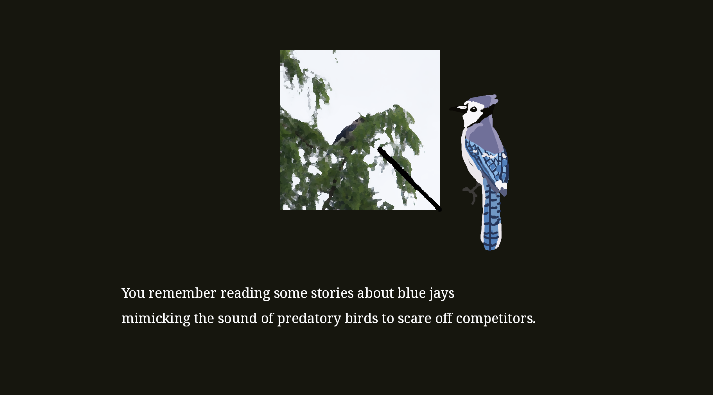

# Schenley Birdwalk Simulator

**Author**: runkunc (Runkun Chen)

**Design**: A simple visual novel about walking inside a Park and discovering birds.
Each path taken leads to different birds; some birds could only be spotted if you look at the right place.

##### Text Drawing

Text drawing is implemented by `TextRenderer.hpp` and `TextRenderer.cpp`, which defines a helper class `TextRenderer`.

A `TextRenderer` instance initializes Harfbuzz and FreeType by loading font files and doing necessary configs; then, text can be rasterized from text by calling `TextRenderer::Rasterize()`. This function returns a vector of `glm::u8vec4` as well as the height and width of the rasterized texture.

In `PlayMode.cpp`, the size of the plane mesh that is rendering the text would rescale based on the returned `height` and `width`.

For the specific implementation, I basically copied chunks of code from these two official examples:
- https://freetype.org/freetype2/docs/tutorial/example1.c
  - Rasterization of font using FreeType
- https://github.com/harfbuzz/harfbuzz-tutorial/blob/master/hello-harfbuzz-freetype.c
  - Typesetting using Harfbuzz

Harfbuzz calculates the location of every glyph while FreeType provides the bitmaps.

##### Choices

The whole game script is written in `assets/script.txt`. It is written in a custom markup language with a syntax similar to Inky.

This markup language defines several control characters; these characters manage how the script should be parsed. When parsing, empty lines are removed; then, the parse sequentially read every line and look for the control character first.

The control characters are:
- `:` - DIALOGUE. A new round of (standard) dialogue. Can be followed by up to two lines without control characters.
- `=` - FLAG. The target location used by JUMP, but ignored when parsing otherwise.
- `~` - CHOICES. This is an interactable multi-choice section, and the next one or two `*` (OPTION) can be chosen.
  - `*` - OPTION. An option of CHOICES. Should be followed by a line of JUMP (`>`) to designate where to goto.
- `>` - JUMP. Basically, `goto` or `jump`. Immediately move the parsing cursor to the target line.
- `+` - ACTION. This is used to change image, audio, or trigger special dialogues.
  - `+e` - End cutscene.
  - `+images/` - Load a different image to the foreground illustration.
  - `+sounds/` - Load a different BGM (or ambient).

Every time the player presses proceed (Space button), the game fetches the next line(s).

##### Screenshot

How To Play:

- Spacebar to proceed
- Up and down arrow to select choices

##### Sources:

Many images are referenced. They are traced over but not directly.

Read [assets/images/README.md]() for a full attribution.

Other assets (photos and recordings) are my own.

---

This game was built with [NEST](NEST.md).

